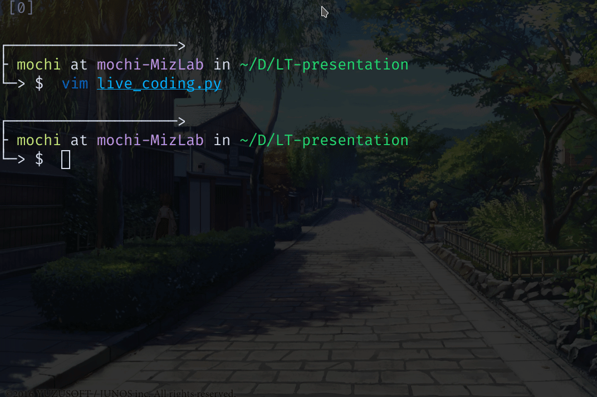

<!-- _class: title -->

# 変数をローマ字で書くのをやめる
# ~codicの紹介

2021-08-26 @技育CAMP LT会

---

## あなたは誰

<div class="flex items-center">
<div class="flex-1">


</div>
<div class="flex-auto">

```
Name: Omochice
Twitter: @omochicemgr
GitHub: Omochice
University: Hirosaki univ.
Hobby: Vim
```

</div>
</div>

---

## 関数|変数の命名

めんどくさいですよね？

---

### 例えば…

- データを取得する
    - `get_data`? `fetch_data`?
- ユーザを登録する
    - `add_user`? `join_user`? `registering_user`?

---

## そんなあなたに

[プログラマーのためのネーミング辞書 | codic](https://codic.jp/)

---

### Vimのプラグインがない…

---

#### つくってしまえばいい

---

<div class="grid">
<div class="column">

### dps-codic-vim

deno(nodeの新しいやつ)製
- TypeScriptで書ける
    - 型がついて嬉しい

</div>
<div class="column2">


</div>
</div>

---

### 問題

> 次の式で定義されるエンゲル係数を求める関数を作成せよ
> > エンゲル係数(%) = 食費 ÷ 収入 × 100

---

#### ライブコーディング



---

## まとめ

- [codic](https://codic.jp/)で関数|変数にいい感じの名前をつけよう！
    - 楽しくコーディングしよう！

---

## 参考資料

-[プログラマーのためのネーミング辞書 | codic](https://codic.jp/)
- Plugin
    - Official
        - [プラグイン | codic](https://codic.jp/plugins)
    - Vim
        - [Omochice/dps-codic-vim: The codic plugin of vim by denops.vim](https://github.com/Omochice/dps-codic-vim)

